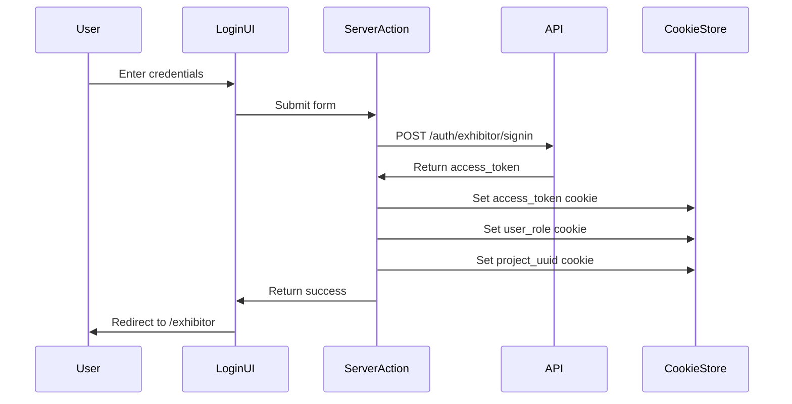
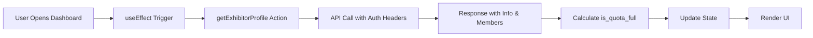
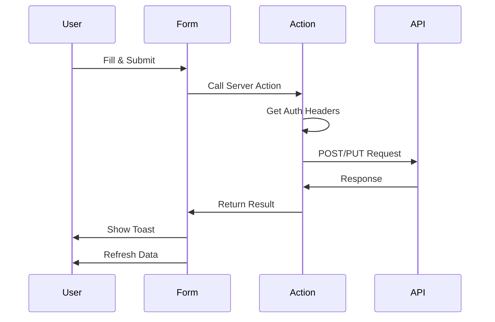

# Expo Flow Manage Exhibitor - Project Analysis

## 📋 Table of Contents

1. [Project Overview](#project-overview)
2. [Technology Stack](#technology-stack)
3. [Project Structure](#project-structure)
4. [Core Features](#core-features)
5. [Authentication & Authorization](#authentication--authorization)
6. [State Management](#state-management)
7. [API Integration](#api-integration)
8. [Component Architecture](#component-architecture)
9. [Routing & Navigation](#routing--navigation)
10. [Data Flow](#data-flow)
11. [Security Considerations](#security-considerations)
12. [Performance Optimizations](#performance-optimizations)

---

## 🎯 Project Overview

**Expo Flow Manage Exhibitor** is a specialized exhibition management platform built for **ILDEX Vietnam 2026** and **Horti & Agri Vietnam 2026** events. This is a B2B portal designed specifically for **exhibitors** to manage their participation in trade exhibitions.

### Purpose
- Provide exhibitors with a self-service portal to manage their company profile
- Enable staff registration and badge management for exhibition personnel
- Streamline the pre-event registration process
- Generate printable badges with QR codes for event access

### Key Business Rules
- **Staff Quota System**: Each exhibitor has a limited quota of staff members they can register
- **Cutoff Date**: Profile editing is locked after a specified deadline (May 15, 2026)
- **Badge Printing**: Additional badges requested onsite incur a charge of US$ 5 per badge
- **Email Confirmation**: Registered staff receive email confirmations for their registration

---

## 🛠 Technology Stack

### Frontend Framework
| Technology | Version | Purpose |
|------------|---------|---------|
| **Next.js** | 16.1.6 | React framework with App Router |
| **React** | 19.2.3 | UI library |
| **TypeScript** | 5.x | Type safety |

### Styling & UI
| Technology | Version | Purpose |
|------------|---------|---------|
| **Tailwind CSS** | 4.x | Utility-first CSS framework |
| **shadcn/ui** | 3.8.4 | Component library (New York style) |
| **Radix UI** | 1.4.3 | Accessible UI primitives |
| **Lucide React** | 0.564.0 | Icon library |
| **next-themes** | 0.4.6 | Dark/light theme support |

### State Management & Forms
| Technology | Version | Purpose |
|------------|---------|---------|
| **Zustand** | 5.0.11 | Global state management |
| **React Hook Form** | 7.71.1 | Form handling |
| **Zod** | 4.3.6 | Schema validation |

### API & Data
| Technology | Version | Purpose |
|------------|---------|---------|
| **Axios** | 1.13.5 | HTTP client |
| **date-fns** | 4.1.0 | Date manipulation |

### Additional Libraries
| Technology | Version | Purpose |
|------------|---------|---------|
| **qrcode.react** | 4.2.0 | QR code generation for badges |
| **react-to-print** | 3.2.0 | Badge printing functionality |
| **xlsx** | 0.18.5 | Excel file handling |
| **sonner** | 2.0.7 | Toast notifications |
| **cmdk** | 1.1.1 | Command palette |
| **bcryptjs** | 3.0.3 | Password hashing (types) |
| **uuid** | 13.0.0 | Unique identifier generation |

### Development Tools
| Technology | Version | Purpose |
|------------|---------|---------|
| **ESLint** | 9.x | Code linting |
| **Prettier** | 3.8.1 | Code formatting |
| **tsx** | 4.21.0 | TypeScript execution |

---

## 📁 Project Structure

```
expo-flow-manage-exhibitor/
├── src/
│   ├── app/                          # Next.js App Router
│   │   ├── (portal)/                 # Protected portal routes (grouped)
│   │   │   ├── exhibitor/
│   │   │   │   ├── page.tsx          # Main exhibitor dashboard
│   │   │   │   ├── print-badge/
│   │   │   │   │   └── [id]/
│   │   │   │   │       └── page.tsx  # Dynamic badge printing page
│   │   │   │   └── staff/            # Staff management (if exists)
│   │   │   └── layout.tsx            # Portal layout with auth guard
│   │   ├── login/
│   │   │   └── page.tsx              # Login page
│   │   ├── actions/                  # Server Actions
│   │   │   ├── auth.ts               # Authentication actions
│   │   │   └── exhibitor.ts          # Exhibitor-related actions
│   │   ├── globals.css               # Global styles
│   │   ├── layout.tsx                # Root layout
│   │   ├── page.tsx                  # Home page (redirects)
│   │   ├── error.tsx                 # Error boundary
│   │   └── not-found.tsx             # 404 page
│   │
│   ├── components/
│   │   ├── ui/                       # shadcn/ui components (29 components)
│   │   │   ├── alert.tsx
│   │   │   ├── avatar.tsx
│   │   │   ├── badge.tsx
│   │   │   ├── button.tsx
│   │   │   ├── card.tsx
│   │   │   ├── dialog.tsx
│   │   │   ├── form.tsx
│   │   │   ├── input.tsx
│   │   │   ├── table.tsx
│   │   │   └── ... (21 more)
│   │   ├── exhibitor/
│   │   │   ├── exhibitor-badge.tsx   # Badge component with QR code
│   │   │   └── portal-staff-management.tsx  # Staff management UI
│   │   ├── app-sidebar.tsx           # Navigation sidebar
│   │   ├── auth-guard.tsx            # Client-side auth protection
│   │   ├── auth-error-handler.tsx    # Auth error handling
│   │   ├── CountrySelector.tsx       # Country selection dropdown
│   │   ├── mode-toggle.tsx           # Theme switcher
│   │   ├── nav-user.tsx              # User menu in sidebar
│   │   ├── portal-navbar.tsx         # Top navigation bar
│   │   └── theme-provider.tsx        # Theme context provider
│   │
│   ├── lib/
│   │   ├── api.ts                    # Axios instance configuration
│   │   ├── auth-helpers.ts           # Auth utility functions
│   │   ├── countries.ts              # Country data (50 countries)
│   │   └── utils.ts                  # cn() utility for classNames
│   │
│   ├── store/
│   │   └── useAuthStore.ts           # Zustand auth state store
│   │
│   ├── hooks/                        # Custom React hooks
│   └── utils/                        # Utility functions
│
├── public/                           # Static assets
├── prisma/                           # Database schema (if used)
├── package.json                      # Dependencies
├── tsconfig.json                     # TypeScript config
├── next.config.ts                    # Next.js config
├── tailwind.config.ts                # Tailwind config
├── components.json                   # shadcn/ui config
└── eslint.config.mjs                 # ESLint config
```

---

## ✨ Core Features

### 1. Exhibitor Dashboard (`/exhibitor`)

**Purpose**: Central hub for exhibitors to manage their exhibition presence.

**Features**:
- **Company Profile Display**: Shows company name, booth number, address, contact details
- **Statistics Cards**: Quick view of username, booth number, staff quota usage
- **Profile Editing**: Update company information (locked after cutoff date)
- **Staff Management**: Add, edit, and manage staff members
- **Badge Printing**: Generate and print badges with QR codes

**Key Components**:
- `StatsCard`: Display key metrics with icons
- `FieldSection`: Grouped form fields with icons
- `FieldItem`: Individual field display/edit component

### 2. Staff Management

**Purpose**: Manage exhibition staff registrations within quota limits.

**Features**:
- **Quota Tracking**: Visual progress bar showing staff count vs. quota
- **Add Staff**: Form to register new staff members
- **Edit Staff**: Update existing staff information
- **Status Toggle**: Activate/deactivate staff members
- **Email Resend**: Resend confirmation emails
- **Table View**: List all registered staff with details

**Business Logic**:
```typescript
const totalQuota = (quota || 0) + (over_quota || 0)
const isQuotaFull = members.length >= totalQuota
const isPastCutoff = cutoffStatus ? !cutoffStatus.is_editable : false
```

**Form Fields**:
- Title (Mr., Ms., Mrs., Dr., Prof., Miss, Other)
- First Name, Last Name
- Job Position
- Email Address
- Mobile Number (with country code selector)
- Company Name, Country, Telephone

### 3. Badge Printing (`/exhibitor/print-badge/[id]`)

**Purpose**: Generate printable badges for registered staff.

**Features**:
- **QR Code Generation**: Unique QR code for each staff member
- **Professional Design**: Consistent branding with event colors
- **Print Optimization**: CSS for proper 4in x 6in badge printing
- **Information Display**: Name, position, company, booth number, badge ID

**Badge Layout**:
```
┌─────────────────────────────────┐
│   EXHIBITOR (Green Header)      │
├─────────────────────────────────┤
│   Expo Flow Management          │
│   Bangkok 2026                  │
├─────────────────────────────────┤
│   [Staff Name]                  │
│   [Job Position]                │
│                                 │
│   [Company Name]                │
│   [Country]                     │
├─────────────────────────────────┤
│   [QR Code]                     │
│   Booth No. | Badge ID          │
└─────────────────────────────────┘
```

### 4. Authentication System

**Purpose**: Secure access control for exhibitors.

**Login Flow**:
1. User enters username and password
2. Server Action posts to `/auth/exhibitor/signin`
3. API returns access token and exhibitor info
4. Token stored in HTTP-only cookie
5. User state updated in Zustand store
6. Redirect to `/exhibitor`

**Session Management**:
- Access token stored in HTTP-only cookie
- Token expiration handled via interceptors
- Automatic redirect to login on 401/403 errors

---

## 🔐 Authentication & Authorization

### Authentication Flow



### Cookie Structure

| Cookie Name | Purpose | Expiration |
|-------------|---------|------------|
| `access_token` | JWT for API authentication | 7 days (configurable) |
| `user_role` | Role identification (EXHIBITOR) | 7 days |
| `project_uuid` | Project identifier | 7 days |

### Middleware Protection

**File**: `src/middleware.ts`

```typescript
export function middleware(request: NextRequest) {
  const path = request.nextUrl.pathname
  const token = request.cookies.get('access_token')?.value

  // Protect portal routes
  if (path.startsWith('/exhibitor') && !token) {
    return NextResponse.redirect(new URL('/login', request.url))
  }

  // Redirect authenticated users from login
  if (path === '/login' && token) {
    return NextResponse.redirect(new URL('/exhibitor', request.url))
  }

  return NextResponse.next()
}
```

### Auth Guard Component

**File**: `src/components/auth-guard.tsx`

Client-side protection that:
- Checks authentication state from Zustand store
- Waits for store hydration
- Redirects to login if not authenticated
- Shows loading spinner during verification

---

## 🗄 State Management

### Zustand Store Structure

**File**: `src/store/useAuthStore.ts`

```typescript
interface User {
  id: string
  username: string
  role: string
  projectUuid?: string
  exhibitorId?: string
}

interface AuthState {
  user: User | null
  isAuthenticated: boolean
  isHydrated: boolean
  login: (user: User) => void
  logout: () => void
  setHydrated: () => void
}
```

### Features
- **Persistence**: State persisted to localStorage
- **Hydration Check**: Prevents SSR mismatches
- **Simple API**: login, logout, hydrate methods

### Usage Example

```typescript
const { user, isAuthenticated, login, logout } = useAuthStore()

// Login
login({
  id: exhibitor_uuid,
  username,
  role: 'EXHIBITOR',
  projectUuid,
  exhibitorId: exhibitor_uuid
})

// Logout
logout()
```

---

## 🌐 API Integration

### API Configuration

**File**: `src/lib/api.ts`

```typescript
const API_URL = process.env.NEXT_PUBLIC_API_URL || 'https://expoflow-api.thedeft.co'

const api = axios.create({
  baseURL: API_URL,
  headers: {
    'Content-Type': 'application/json',
  },
})
```

### Request Interceptors

**Development Logging**:
```typescript
api.interceptors.request.use((config) => {
  if (process.env.NODE_ENV === 'development') {
    console.log('====== API REQUEST ======')
    console.log(`[${config.method?.toUpperCase()}] ${config.url}`)
    if (config.data) {
      console.log('Payload:', JSON.stringify(config.data, null, 2))
    }
  }
  return config
})
```

### Response Interceptors

**Success Handler**:
- Logs response data in development
- Returns response to caller

**Error Handler**:
- Logs error details
- Returns rejected promise
- Different logging for dev vs production

### Server Actions

#### Authentication Actions (`src/app/actions/auth.ts`)

**`exhibitorLoginAction(formData: FormData)`**
- Validates input
- Posts to `/auth/exhibitor/signin`
- Sets cookies on success
- Returns user object or error

**`logoutAction()`**
- Clears all auth cookies
- Returns success status

#### Exhibitor Actions (`src/app/actions/exhibitor.ts`)

| Action | Method | Endpoint | Purpose |
|--------|--------|----------|---------|
| `getExhibitorProfile` | GET | `/v1/exhibitor/profile` | Fetch company & members |
| `updateExhibitorProfile` | PUT | `/v1/exhibitor/profile` | Update company info |
| `getExhibitorCutoffStatus` | GET | `/v1/exhibitor/cutoff-status` | Check editing deadline |
| `addExhibitorMember` | POST | `/v1/exhibitor/members` | Register new staff |
| `updateExhibitorMember` | PUT | `/v1/exhibitor/members/` | Update staff info |
| `toggleExhibitorMemberStatus` | PATCH | `/v1/exhibitor/members/toggle_status` | Activate/deactivate |
| `resendMemberEmailConfirmation` | POST | `/v1/exhibitor/members/resend_email_comfirmation` | Resend email |

### Token Expiration Handling

**File**: `src/lib/auth-helpers.ts`

```typescript
export function isTokenExpiredError(error: AxiosError): boolean {
  if (!error?.response) return false

  const status = error.response.status
  const message = error.response.data?.message

  if (status === 400 && message === 'key incorrect') return true
  if (status === 401) return true

  return false
}
```

Used across all server actions to detect expired tokens and trigger re-authentication.

---

## 🧩 Component Architecture

### Component Hierarchy

```
RootLayout
├── ThemeProvider
│   └── children
│
PortalLayout (Protected)
├── AuthGuard
│   └── AuthErrorHandler
│       └── PortalNavbar
│           └── ModeToggle
│           └── UserDropdown
│               └── Avatar
│               └── NavUser
└── Main Content
    └── ExhibitorPage
        ├── StatsCard (×3)
        ├── CompanyInformationCard
        │   ├── FieldSection (×3)
        │   │   └── FieldItem (×4)
        │   └── EditControls
        └── PortalStaffManagement
            ├── StaffTable
            │   └── StaffRow (×n)
            ├── AddStaffDialog
            │   └── StaffForm
            └── ResendEmailDialog
```

### Key Component Patterns

#### 1. **Compound Components**
shadcn/ui uses Radix primitives to create accessible compound components:
- `Dialog` + `DialogContent` + `DialogHeader` + `DialogTitle`
- `Table` + `TableHeader` + `TableBody` + `TableRow` + `TableCell`

#### 2. **Render Props / Children Pattern**
```typescript
function AuthGuard({ children }: { children: React.ReactNode }) {
  // ... auth logic
  return <>{children}</>
}
```

#### 3. **Controlled Components**
Forms use controlled inputs with state:
```typescript
const [formData, setFormData] = useState({...})
<Input value={formData.email} onChange={e => setFormData({...})} />
```

#### 4. **Utility Component Pattern**
```typescript
function StatsCard({ icon, label, value, iconBg, extra }) {
  return (
    <Card>
      <CardContent className="flex items-center p-5 gap-4">
        <div className={`w-11 h-11 rounded-xl ${iconBg}`}>{icon}</div>
        <div>
          <p className="text-xs font-medium text-muted-foreground">{label}</p>
          <p className="text-xl font-bold">{value}</p>
        </div>
      </CardContent>
    </Card>
  )
}
```

### shadcn/ui Components Used

| Component | Usage |
|-----------|-------|
| `alert` | Warning messages (cutoff, quota) |
| `avatar` | User profile images |
| `badge` | Status indicators |
| `breadcrumb` | Navigation (if used) |
| `button` | All interactive buttons |
| `calendar` | Date selection (if used) |
| `card` | Content containers |
| `checkbox` | Form checkboxes |
| `collapsible` | Expandable sections |
| `command` | Command palette |
| `dialog` | Modal dialogs |
| `dropdown-menu` | User menus |
| `form` | Form wrapper with validation |
| `input` | Text inputs |
| `label` | Form labels |
| `popover` | Popover menus |
| `progress` | Quota progress bar |
| `radio-group` | Radio buttons |
| `scroll-area` | Scrollable containers |
| `select` | Dropdown selects |
| `separator` | Visual dividers |
| `sheet` | Slide-out panels |
| `sidebar` | Navigation sidebar |
| `skeleton` | Loading states |
| `switch` | Toggle switches |
| `table` | Data tables |
| `tabs` | Tabbed interfaces |
| `textarea` | Multi-line inputs |
| `tooltip` | Hover tooltips |

---

## 🛣 Routing & Navigation

### Route Structure

| Route | Type | Access | Purpose |
|-------|------|--------|---------|
| `/` | Public | All | Redirects to `/exhibitor` |
| `/login` | Public | Unauthenticated | Exhibitor login |
| `/exhibitor` | Protected | Exhibitors | Main dashboard |
| `/exhibitor/print-badge/[id]` | Protected | Exhibitors | Print staff badge |

### Route Groups

**`(portal)`** - Route group for protected portal pages
- Allows shared layout without affecting URL path
- Contains all authenticated routes

### Navigation Methods

#### Client-Side Navigation
```typescript
import { useRouter } from 'next/navigation'

const router = useRouter()
router.push('/exhibitor')
router.back()
```

#### Server-Side Redirects
```typescript
import { redirect } from 'next/navigation'

export default function Home() {
  redirect('/exhibitor')
}
```

#### Middleware Redirects
```typescript
return NextResponse.redirect(new URL('/login', request.url))
```

---

## 🔄 Data Flow

### Profile Data Flow



### Form Submission Flow



### State Update Pattern

```typescript
// 1. Fetch data
const fetchData = useCallback(async () => {
  const result = await getExhibitorProfile()
  if (result.success) {
    setExhibitorInfo(result.data.info)
    setMembers(result.data.members)
  }
}, [])

// 2. Use in component
useEffect(() => {
  fetchData()
}, [fetchData])

// 3. Refresh after mutation
async function handleSave() {
  const result = await updateExhibitorProfile(data)
  if (result.success) {
    fetchData() // Refresh
  }
}
```

---

## 🔒 Security Considerations

### 1. HTTP-Only Cookies
- Access tokens stored in HTTP-only cookies
- Not accessible via JavaScript (XSS protection)
- Secure flag in production (HTTPS only)
- SameSite=Lax (CSRF protection)

### 2. Server-Side Validation
- All form data validated on server
- Server Actions run on server, not exposed to client
- Input sanitization before API calls

### 3. Authentication Checks
- Middleware protects routes at edge
- Auth Guard protects on client
- Server Actions verify tokens

### 4. Token Expiration
- Tokens have limited lifetime (7 days)
- Expired tokens detected via interceptors
- Automatic redirect to login

### 5. Role-Based Access
- User role stored in cookie
- Different roles have different permissions
- Frontend checks role before rendering

---

## ⚡ Performance Optimizations

### 1. React Server Components
- Default components are server components
- Reduced JavaScript bundle size
- Faster initial page load

### 2. Client Components Only When Needed
```typescript
'use client'  // Only for interactive components
```

### 3. Code Splitting
- Next.js automatic code splitting
- Route-based chunks
- Dynamic imports for heavy components

### 4. Image Optimization
- Next.js Image component (if used)
- Automatic format selection
- Lazy loading

### 5. Font Optimization
```typescript
const inter = Inter({
  variable: "--font-inter",
  subsets: ["latin"],
  weight: ["300", "400", "500", "600", "700"],
})
```
- Self-hosted fonts
- Preloaded font subsets
- No layout shift

### 6. CSS Optimizations
- Tailwind CSS purges unused styles
- Small CSS bundle size
- Utility classes reduce custom CSS

### 7. State Hydration
```typescript
const { isHydrated } = useAuthStore()
if (!isHydrated) return <Loader />
```
- Prevents hydration mismatches
- Avoids unnecessary re-renders

### 8. Memoization
```typescript
const fetchData = useCallback(async () => {
  // ...
}, [])

useEffect(() => {
  fetchData()
}, [fetchData])
```
- Prevents infinite loops
- Optimizes re-renders

### 9. Print Optimization
```css
@media print {
  .print-badge {
    box-shadow: none !important;
    border: none !important;
    width: 4in !important;
    height: 6in !important;
  }
  body > *:not(.print-area) {
    display: none !important;
  }
}
```
- Hides UI elements when printing
- Optimized print layout
- Reduces ink usage

---

## 📊 Testing Strategy

### Manual Testing Areas

1. **Authentication**
   - Login with valid/invalid credentials
   - Session persistence
   - Logout flow
   - Token expiration

2. **Profile Management**
   - View profile
   - Edit profile (before cutoff)
   - Edit blocked (after cutoff)
   - Form validation

3. **Staff Management**
   - Add staff (within quota)
   - Add staff (exceed quota - should fail)
   - Edit staff
   - Toggle status
   - Resend email

4. **Badge Printing**
   - Badge preview
   - Print functionality
   - QR code scanning
   - Print layout (4x6 inches)

5. **Responsive Design**
   - Mobile view
   - Tablet view
   - Desktop view
   - Print view

6. **Theme**
   - Light mode
   - Dark mode
   - Theme persistence

---

## 🚀 Deployment Considerations

### Environment Variables

```env
NEXT_PUBLIC_API_URL=https://expoflow-api.thedeft.co
```

### Build Process

```bash
npm run build
# Produces optimized production build
```

### Hosting Recommendations

1. **Vercel** (Recommended for Next.js)
   - Automatic deployments
   - Edge functions
   - Image optimization

2. **Node.js Server**
   ```bash
   npm run start
   ```

3. **Docker**
   - Containerized deployment
   - Consistent environments

### Performance Monitoring

- Use Vercel Analytics or similar
- Monitor API response times
- Track error rates with Sentry
- Monitor Core Web Vitals

---

## 📝 Conclusion

**Expo Flow Manage Exhibitor** is a well-structured, modern Next.js application that demonstrates:

✅ **Best Practices**:
- TypeScript for type safety
- Server Components for performance
- HTTP-only cookies for security
- Zustand for simple state management
- shadcn/ui for consistent UI

✅ **Scalability**:
- Modular component architecture
- Clear separation of concerns
- Reusable utilities and helpers

✅ **User Experience**:
- Responsive design
- Dark mode support
- Smooth animations
- Clear feedback with toasts

✅ **Security**:
- Protected routes
- Token-based authentication
- Server-side validation

This platform serves as a solid foundation for exhibition management and can be extended with additional features like analytics, reporting, or multi-language support.
